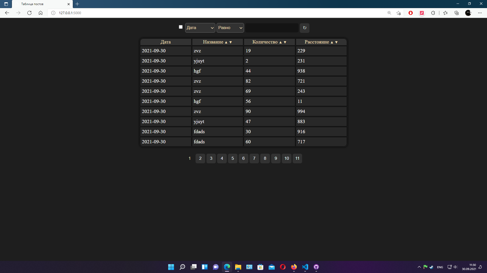
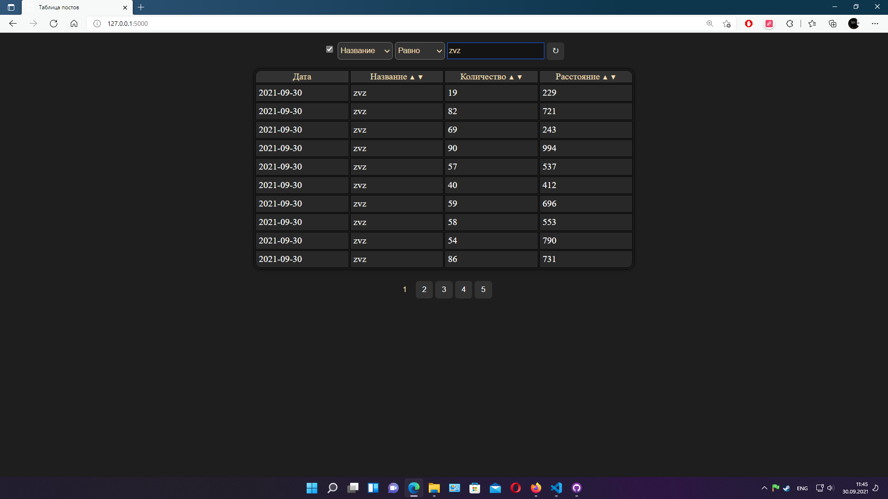
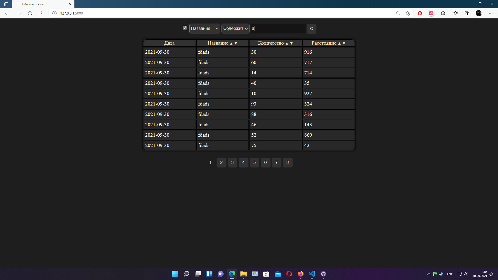
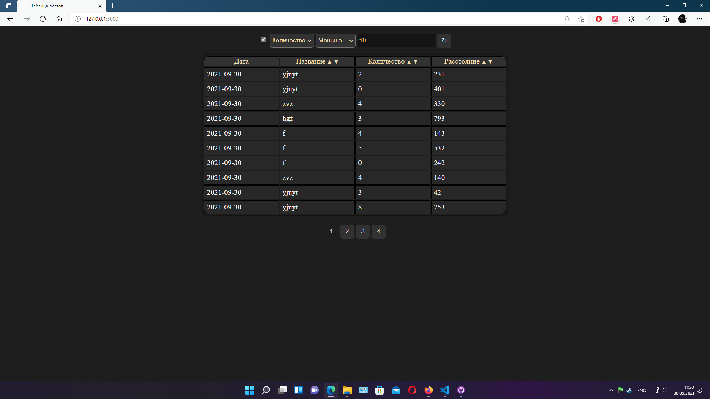
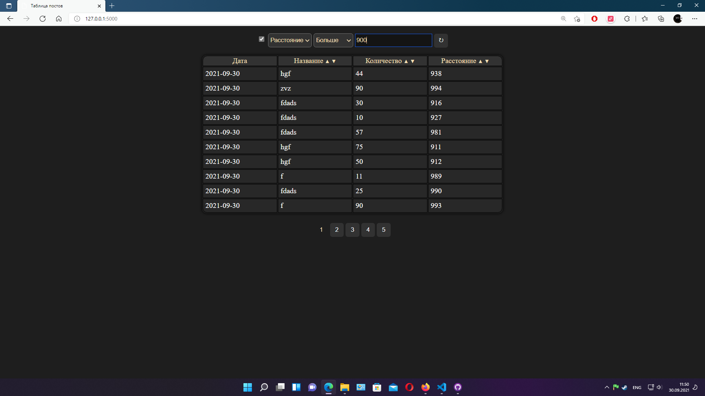
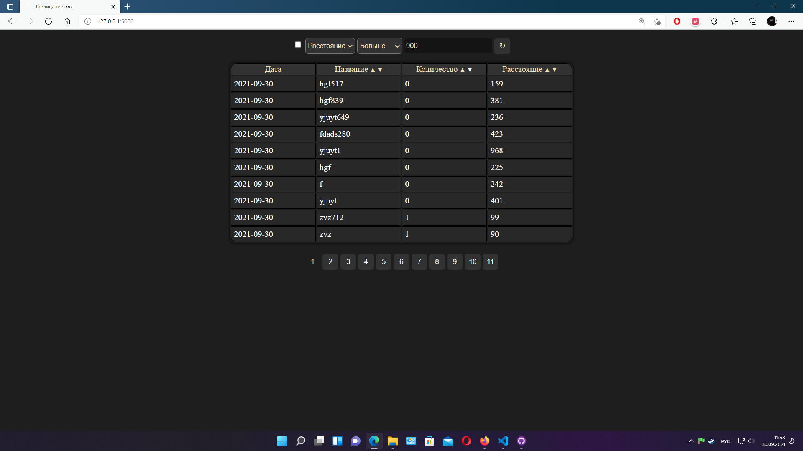
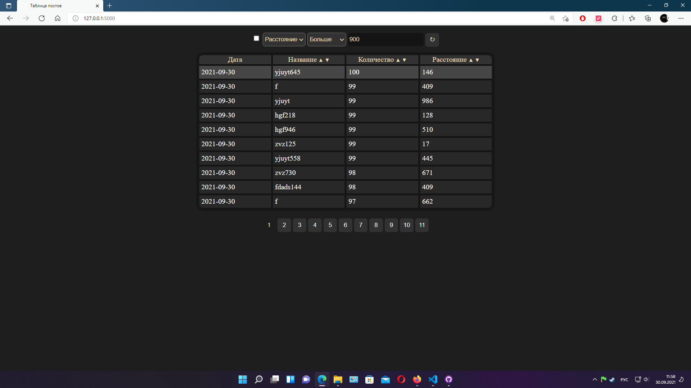
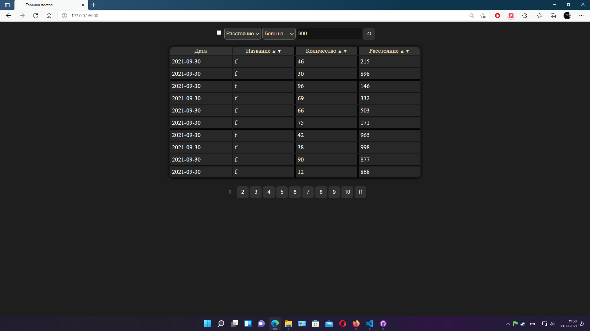

# Single-Page-Application

# ТЗ проекта: https://faint-adasaurus-4bc.notion.site/web-Python-adf33211e9cc4d6b9ec2c0c619ecab31

<h3> 
    Я разработал веб-приложение, на основе ТЗ,
    которое мне предоставили.
    Надеюсь, что я всё верно понял, а так на то, 
    что все скрины на своих местах :)
</h3>

<h5> На данном одностранничном сайте находяться:
      - Фильтр
      - Таблица
      - Панель навигации
</h5>

# Фильтр

 
    Фильтр поддерживает несколько 
    параметров фильтрации:
        Равно[Value], Содержит[Value], 
        Больше[Value], Меньше[Value]

<h5>Равно</h5>

<h5>Содержит</h5>

<h5>Больше</h5>

<h5>Меньше</h5>

# Навигация

 
    Значения в таблице полноценно переключаются через 
    панель навигации.
    Навигация работает при установленном фильтре и сортировке - они ей никак не помешают, как и она им

# Сортировка

    Сортировка работает для всех колонок, кроме даты
      - Первое нажатие > установка сортировки
      - Второе нажатие по той же кнопке > отмена сортировки
      Виды сортировки:
      - По возрастанию
      - По убыванию 
      - В алфавитном порядке
      - В обратном алфавитном порядке

<h5>  По возрастанию
    
</h5>

<h5>  По убыванию
    
</h5>

<h5>  В алфавитном порядке
    
</h5>

<h5>  В обратном алфавитном порядке
    
</h5>

# БД
<h3> 
    Я использовал MySql Server, который был запущен
    через OpenServer на локальном хосте
      Данные и скрины таблицы, которые смогу -  я предоставлю
</h3>

# Завершение 

<h3> Думаю этого хватит, потому что я больше не знаю, что еще нужно скинуть :( ,
     ибо ни разу этим не занимался <h3>